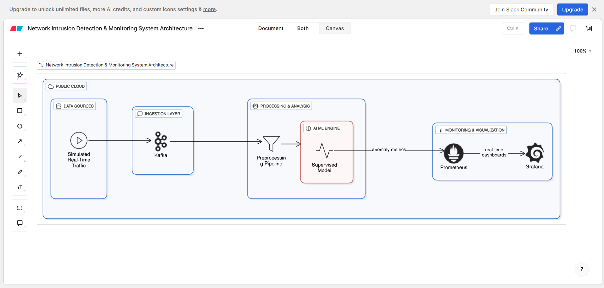
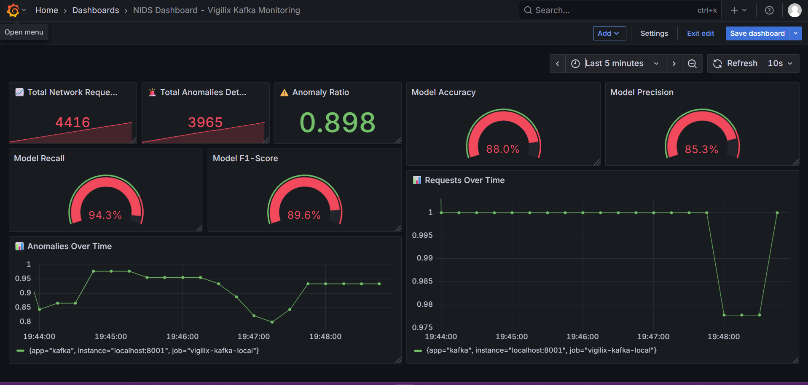

# 🛡️ Vigilix – Intrusion Detection & Monitoring System

Welcome to **Vigilix**, an intelligent anomaly detection pipeline designed to identify and monitor network intrusions in real-time. This project leverages machine learning models, real-time data streaming, and monitoring tools to provide a robust and scalable solution for anomaly detection.

---

## 📚 Overview

**Vigilix** is a modular and production-ready system that combines classical machine learning models with real-time monitoring capabilities. It is designed to process network data, detect anomalies, and visualize system performance metrics in real-time.

### Key Features:
- **Anomaly Detection Models:** Implements Isolation Forest, Random Forest, and XGBoost for anomaly detection.
- **Real-Time Data Streaming:** Uses Kafka for real-time data ingestion and processing.
- **Monitoring Stack:** Integrates Prometheus and Grafana for real-time metrics visualization.
- **Exploratory Data Analysis (EDA):** Provides insights into the dataset with statistical summaries and visualizations.
- **Preprocessing Utilities:** Includes scripts for data cleaning, transformation, and feature engineering.
- **Model Evaluation:** Tracks model performance with confusion matrices, feature importance, and evaluation metrics.
- **CI/CD Ready:** Compatible with CI/CD pipelines for automated testing and deployment.

---

## 🖼️ System Architecture

### Network Intrusion Detection & Monitoring System Architecture


This architecture illustrates the Vigilix pipeline:
1. **Data Ingestion:** Raw network data is ingested into Kafka topics.
2. **Data Processing:** Data is preprocessed and streamed to machine learning models for inference.
3. **Anomaly Detection:** Models classify data as normal or anomalous.
4. **Monitoring:** Prometheus collects metrics, and Grafana visualizes them in real-time dashboards.

---

## 🖥️ Dashboard Example

### Vigilix Kafka Real-Time Monitoring Dashboard


The dashboard provides real-time insights, including:
- Total network requests processed.
- Number of anomalies detected.
- Anomaly detection ratio.
- Model performance metrics (e.g., accuracy, precision, recall).

---

## 🧭 Project Structure

```bash
atharsayed-vigilix/
├── README.md                           # Project overview, setup guide, and usage documentation
├── requirements.txt                    # Python dependencies for model, Kafka, and monitoring
├── dockerfile                          # Docker build file for the Vigilix app service
├── docker-compose.yml                  # Multi-service orchestration (App, Kafka, Zookeeper, Prometheus, Grafana)
├── .gitignore                          # Excludes large datasets, build cache, logs, and system files
│
├── data/                               # (gitignored) Raw and processed datasets
│   ├── raw/                            # Raw unprocessed data files (CSV, JSON, etc.)
│   └── processed/                      # Cleaned and split datasets for model training/testing (.parquet)
│
├── models/                             # ML model training, tuning, and inference scripts
│   ├── app.py                          # Model evaluation entry point (train/test and log metrics)
│   ├── hyper_xgb.py                    # Hyperparameter tuning script for XGBoost
│   ├── isolation_forest.py             # Isolation Forest-based anomaly detection
│   ├── random_forest.py                # Random Forest classification implementation
│   └── xgboost_model.py                # XGBoost model for classification/anomaly detection
│
├── monitoring/                         # Monitoring and observability setup for Vigilix
│   ├── grafana/                        # Grafana dashboards and provisioning
│   │   ├── datasource.yaml             # Pre-configured Prometheus datasource for Grafana
│   │   ├── dashboards.yaml             # Dashboard auto-provisioning configuration
│   │   └── vigilix_dashboard.json      # Custom Vigilix dashboard for live metrics visualization
│   │
│   ├── prometheus/                     # Prometheus-specific configurations
│   │   └── prometheus.yml              # Local Prometheus config for manual runs
│   │
│   └── prometheus.docker.yml           # Prometheus config for Docker environment (targets internal container names)
│
├── results/                            # Logs, visual outputs, and model performance reports
│   ├── eda/                            # EDA (Exploratory Data Analysis) summaries
│   │   └── eda_summary.txt             # Descriptive statistics and data insights summary
│   │
│   ├── images/                         # Visual documentation (architecture diagrams, dashboards)
│   │   ├── Sample-Dashboard-Screenshot.png  # Snapshot of Grafana dashboard
│   │   └── System-Design.png                # End-to-end Vigilix system architecture
│   │
│   └── models/                         # Model evaluation logs and result files
│       ├── isolationforest_results.txt      # Isolation Forest results
│       ├── RandomForest_results.txt         # Random Forest results
│       ├── XGBoost_results.txt              # XGBoost baseline results
│       └── XGBoost_Tuned_results.txt        # XGBoost hyperparameter tuning results
│
├── scripts/                            # Automation and helper scripts for local environment setup
│   ├── start-kafka.bat                 # Windows script to start Zookeeper & Kafka manually
│   └── start-prometheus.bat            # Windows script to start Prometheus manually   
│
├── src/                                # Core application logic and orchestration layer
│   ├── main.py                         # 🔥 Main orchestrator — runs producer, consumer, model inference, and metrics
│   ├── eda.py                          # Performs exploratory data analysis on raw/processed data
│   ├── preprocess.py                   # Cleans, normalizes, and encodes raw data before training
│   └── utils.py                        # Shared helper functions (logging, Kafka utilities, config parsing)
│
├── streaming/                          # Kafka real-time data streaming modules
│   ├── kafka_producer.py               # Producer that sends live data into Kafka topics
│   ├── kafka_consumer.py               # Consumer that processes and scores streaming data
│   └── synthetic_producer.py           # Synthetic data generator for simulating real-time streams
│
└── testing/                            # Unit and integration tests for model and pipeline
   └── test_app.py                     # Tests model inference and main orchestration logic

```

---

## 🚀 Getting Started

### Prerequisites
- Python 3.8 or higher
- Docker and Docker Compose
- Java Runtime Environment (for Kafka)

### Installation
1. Clone the repository:
   ```bash
   git clone https://github.com/AtharSayed/vigilix.git
   cd vigilix
   ```

2. Build the Docker Image
   ```bash
   docker compose build --no-cache app
   ```

3. Start the Entire Stack:
   ```bash
   docker compose up -d
   ```

4. Verify Containers
   ```bash
   docker ps
   ```
- This launches all the services in the container.
---

| Service        | URL                                            | Description                                            |
| -----------    | ---------------------------------------------- | ------------------------------------------------------ |
| **Grafana**    | [http://localhost:3000](http://localhost:3000) | Visualization Dashboard (user: `admin`, pass: `admin`) |
| **Prometheus** | [http://localhost:9090](http://localhost:9090) | Metrics and targets                                    |
| **Kafka**      | `localhost:9094`                               | Kafka broker (accessible via internal `kafka:9092`)    |


## 🛠️ Components

### 1. **Data Pipeline**
- **Kafka Producer:** Streams synthetic or real network data to Kafka topics.
- **Kafka Consumer:** Consumes data from Kafka topics and sends it to the ML models for inference.

### 2. **Machine Learning Models**
- **Isolation Forest:** Unsupervised anomaly detection model.
- **Random Forest:** Supervised classification model.
- **XGBoost:** Gradient boosting model for high-performance classification.

### 3. **Monitoring Stack**
- **Prometheus:** Collects metrics from the pipeline and models.
- **Grafana:** Visualizes metrics in real-time dashboards.

---

## 📊 Results

### Exploratory Data Analysis (EDA)
- **Correlation Heatmap:** Visualizes relationships between features.
- **Label Distribution:** Shows the distribution of normal vs. anomalous data.
- **Attack Category Distribution:** Highlights the types of attacks in the dataset.

### Model Evaluation
- **Confusion Matrices:** Evaluate model performance.
- **Feature Importance:** Identify the most important features for classification.
- **Metrics:** Accuracy, precision, recall, and F1-score.

---

## 🧪 Testing

### Unit Tests
Run test_app.py to see the results of the prediction There are 2 attack and 2 non attack payloads hardcoded in the fiile that will be send to the model and in return the model will predict whether its an attack or not .
```bash
pytest testing/
```

---

## 🛡️ License

This project is licensed under the [MIT License](LICENSE).

---

## 🤝 Contributing

Contributions are welcome! Please follow these steps:
1. Fork the repository.
2. Create a new branch for your feature or bug fix.
3. Submit a pull request with a detailed description of your changes.

---


## 🌟 Acknowledgments

- **Kafka:** For real-time data streaming.
- **Prometheus & Grafana:** For monitoring and visualization.
- **Scikit-learn & XGBoost:** For machine learning models.
- **UNSW-NB15 Dataset:** For providing the dataset used in this project.
